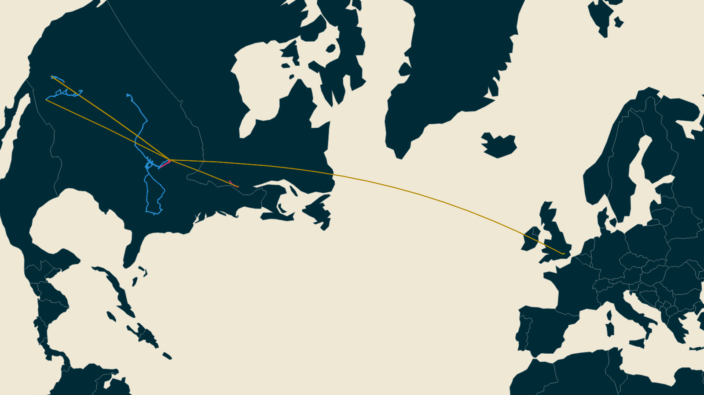
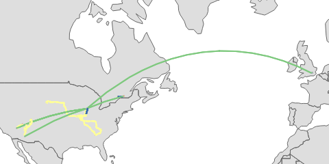
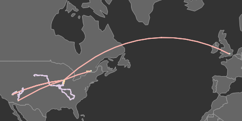
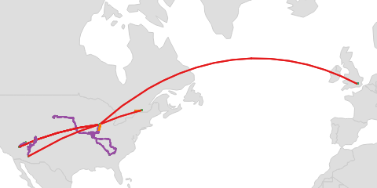
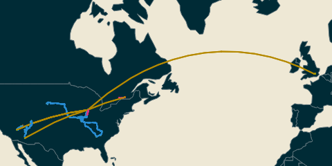

# Moves App Visualizer

Create visualizations from your [Moves App](https://accounts.moves-app.com/) location history as a PNG or SVG.

## Installation

Install the command line client via NPM:
```bash
npm install -g @claygregory/moves-viz
```

## Usage

First, you'll need your [Moves App export](https://accounts.moves-app.com/export), extracting the JSON archive for the `storyline.json` of interest. For example, use `exports/json.zip/full/storyline.json` for your complete location history.

### Examples

To plot a map of your moves, use the `map` command:

```bash
moves-viz map storyline.json map.png
```

A more complete example, customizing the output:
```bash
moves-viz map --projection conic-conformal --theme solarized --height 900 --width 1600 storyline.json map.png
```



### Color Themes

Use `--theme` to select from the below color palettes.

| Name             | `--theme`      | Example | Description 
|---               |---             |---      |---
| **Accent**       | `accent`       |  | Based on the [Color Brewer Accent](http://colorbrewer2.org/#type=qualitative&scheme=Accent) palette

| **Default**      | `default`      |  | Based on the [D3 Category10](https://github.com/d3/d3-scale/blob/master/README.md#schemeCategory10) palette
| **Pastel**       | `pastel`       |  | Based on the [Color Brewer Pastel1](http://colorbrewer2.org/#type=qualitative&scheme=Pastel1) palette
| **Set1**         | `set1`         |  | Based on the [Color Brewer Set1](http://colorbrewer2.org/#type=qualitative&scheme=Set1) palette
| **Solarized**    | `solarized`    |  | Based on [Ethan Schoonover's Solarized](http://ethanschoonover.com/solarized) palette

### Output Format

By default, a PNG file is created. You can optionally export as an SVG using `--format svg`.

### Output Size

You can control the height/width of the output image with `--height <size-in-pixels>` and `--width <size-in-pixels>`.


### Additional Help

To access basic usage information:
```bash
moves-viz --help
```

Include the command to see command-specific options:
```bash
moves-viz map --help
```

## License

See the included [LICENSE](LICENSE.md) for rights and limitations under the terms of the MIT license.
