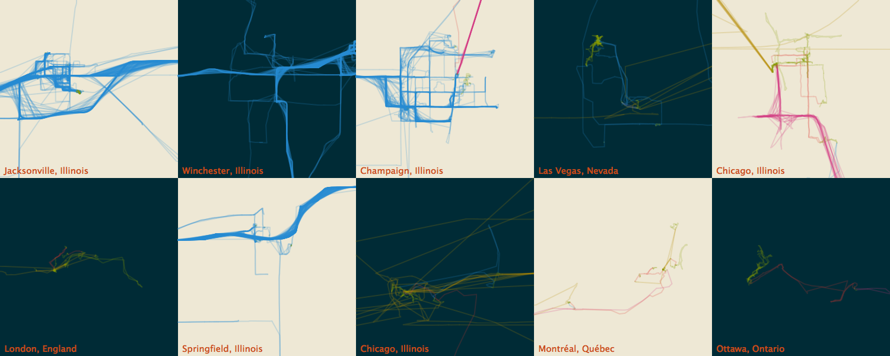

# Moves App Visualizer

Create visualizations from your [Moves App](https://www.moves-app.com/) location history.

## Installation

Install the command line client via NPM:
```bash
npm install -g @claygregory/moves-viz
```

## Usage

First, you'll need your [Moves App export](https://accounts.moves-app.com/export), extracting the JSON archive for the `storyline.json` of interest. For example, use `[export]/json.zip/full/storyline.json` to visualize your complete location history.

As a command-line app, basic usage takes the form:
```bash
moves-viz [command] path/to/storyline.json path/to/output-image.png
```

### Map

Plot an overview map of your travels using default settings using the `map` command:
```bash
moves-viz map storyline.json map.png
```

Or customize the `map` output, selecting a color theme and map projection:
```bash
moves-viz map --projection conic-conformal --theme solarized --height 900 --width 1600 storyline.json map.png
```


Additional options can be found via `moves-viz map --help`.

### Small Multiple Cities

Plot a city-based small multiples grid, inspired by [Nicholas Felton's GPX Map Mosaic](https://github.com/feltron/Processing_GPXMapMosaic), using the `cities` command:

```bash
moves-viz cities storyline.json cities.png
```

Or customize the `cities` output, selecting a theme and limiting display to the top 10 cities:
```bash
moves-viz cities --theme solarized --limit 10 --height 600 --width 1500 storyline.json cities.png
```


Additional options can be found via `moves-viz cities --help`.

### Color Themes

Use `--theme` to select from the below color palettes.

| Name             | `--theme`      | Example | Description 
|---               |---             |---      |---
| **Accent**       | `accent`       |  | Based on the [Color Brewer Accent](http://colorbrewer2.org/#type=qualitative&scheme=Accent) palette
| **Default**      | `default`      |  | Based on the [D3 Category10](https://github.com/d3/d3-scale/blob/master/README.md#schemeCategory10) palette
| **Pastel**       | `pastel`       |  | Based on the [Color Brewer Pastel1](http://colorbrewer2.org/#type=qualitative&scheme=Pastel1) palette
| **Set1**         | `set1`         |  | Based on the [Color Brewer Set1](http://colorbrewer2.org/#type=qualitative&scheme=Set1) palette
| **Solarized**    | `solarized`    |  | Based on [Ethan Schoonover's Solarized](http://ethanschoonover.com/solarized) palette

### Output Format

A PNG file is created by default. If you'd like an SVG, use `--format svg`.

### Output Size

You can control the height/width of the output image with `--height <size-in-pixels>` and `--width <size-in-pixels>`.

### Filter Date Range

Filter your activity to a specific date/time range using `--start-date <date-optional-time>` and `--end-date <date-optional-time>`. The dates should be specified in ISO8601 format; time is optional.

### Additional Help

To discover basic command and usage information:
```bash
moves-viz --help
```

Include the command to see all available options:
```bash
moves-viz [command] --help
```

## License

See the included [LICENSE](LICENSE.md) for rights and limitations under the terms of the MIT license.
